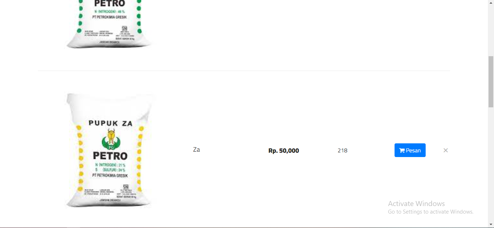
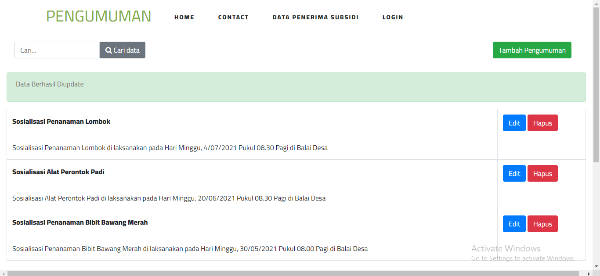

Website ini dikembangkan dengan html, css, bootstrap dan laravel. Sedangkan database menggunakan MySql. Website ini memiliki dua roles user, yaitu admin dan petani. berikut adalah fitur-fitur yang ada didalam website untuk sisi petani:

1. Home
   saat pertama kali membuka website, user akan ditampilkan halaman home sebagai pembuka
   
   
   

2. Contact us
    
    Untuk menu contact ini sendiri merupakan salah satu menu yang menunjukkan contact admin dari web PETANIKU tersebut. Sehingga pengunjung bisa melihat dan mengetahui contact tersebut.
    
    
    

3. Data Penerima Subsidi
    
    Menu ini sendiri ditujukan untuk user / pengunjung website yang ingin mengetahui informasi terkait data para petani yang terdaftar sebagai penerima bantuan pupuk        subsidi. 
    
    

Berikut adalah fitur-fitur pada sisi admin :

1. Login
    
    Login dikhususkan untuk admin agar dapat mengakses dashboard dan data
    

2. Dashboard

    Dashboard admin terdapat beberapa fitur di atas tersebut dan bisa mengetahui data yang menampilkan total admin, total petani, dan total jenis pupuk.
    

    
3. Register
    
    Untuk register ini sendiri hanya bisa dilakukan oleh admin yang sebelumnya sudah terdaftar datanya di sistem website PETANIKU, sehingga jika ada admin baru atau    ada keinginan untuk menambah user admin baru, pihak admin lamalah yang akan mendaftarkannya ke dalam sistem website PETANIKU

    

    
4. Daftar Produk

    Halaman ini berisi mengenai daftar produk pupuk yang dapat di pesan, berikut dengan total pembayaran

    
    

8. Invoice Transaksi

    halaman ini berisi mengenai hasil rekap pembelian pupuk.

    

10. Kelola Data Penerima Subsidi

    Halaman ini memungkinkan admin untuk melakukan perubahan pada data penerima subsidi.

    

12. Kelola Pengumuman
    
    Halaman pengumuman ini digunakan untuk melakukan perubahan pada data pengumuman, data ini juga dapat dilihat pada home website

    

13. Kelola Artikel

    Halaman Artikel ini digunakan untuk melakukan perubahan pada data Artikel, data ini juga dapat dilihat pada home website

14. Kelola Saran

    Halaman saran ini digunakan untuk melakukan perubahan pada data saran, data ini diperoleh dari masukan user yang terletak pada halaman contact
